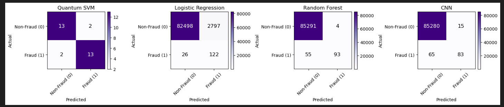
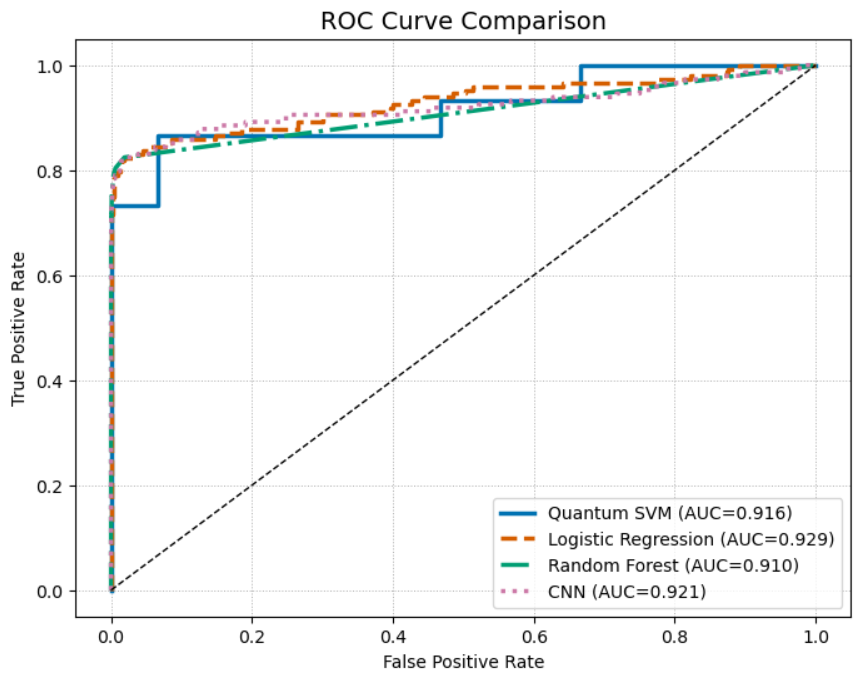
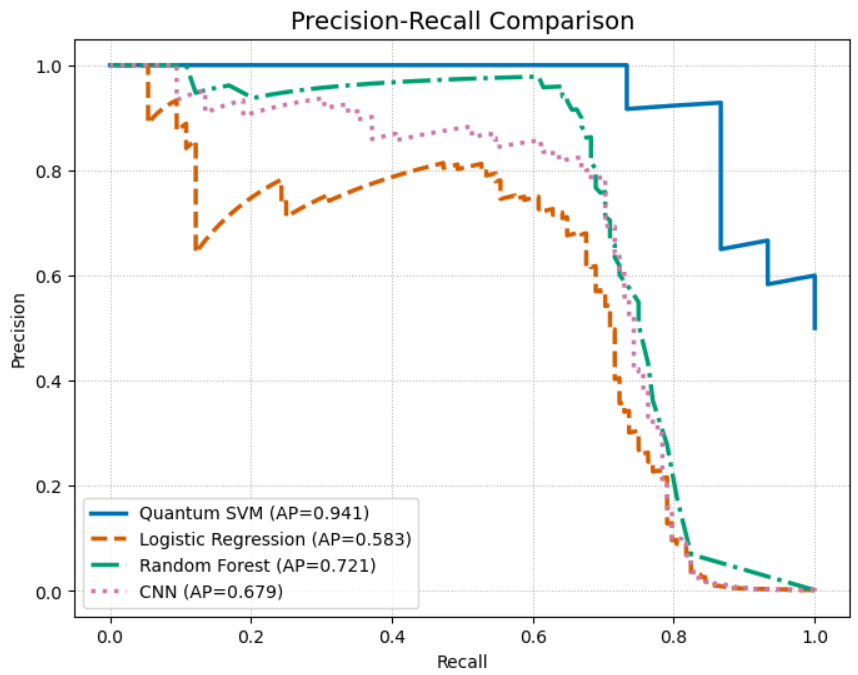

# Quantum Machine Learning for Fraud Detection  
### Quantum Kernel SVM using PennyLane and Scikit-Learn

---

## Overview
This project explores **Quantum Machine Learning (QML)** techniques for **credit card fraud detection** using **Quantum Support Vector Machines (QSVM)**, alongside **classical models** and a **1D Convolutional Neural Network (CNN)**.

The goal is to compare the performance of quantum, classical, and deep learning models in detecting fraudulent credit card transactions.
It leverages **PennyLane**, **Scikit-Learn**, **PyTorch**, and **imbalanced-learn** to handle highly imbalanced transaction data, focusing on precision, recall, and overall accuracy.


The project demonstrates how **quantum feature maps** can potentially capture complex correlations in transaction data for anomaly detection, while also comparing traditional machine learning models and deep learning models in terms of their effectiveness for fraud detection.

---

## Project Structure
```plaintext

Project
  ├── creditcard.csv # Credit Card Fraud dataset
  ├── QML_Fraud_Detection_QSVM.ipynb # Main Jupyter Notebook (Quantum SVM implementation)
  ├── README.md # Project documentation

```


---

## Features
- Load and preprocess credit card fraud data
- Apply PCA to reduce feature dimensions to match the number of qubits
- Train **classical models** (Logistic Regression, Random Forest) as baselines
- Build **Quantum Kernel SVM** using a custom quantum feature map
- Train a 1D CNN (PyTorch) for fraud detection
- Handle imbalanced data using RandomOverSampler
- Evaluate performance using:
    - Precision, Recall, F1-Score
    - ROC-AUC
    - Average Precision (AP)
- Visualize results with:
    - Confusion Matrices 
    - ROC Curves 
    - Precision-Recall Curves

---

## Dataset
You can use the **Kaggle Credit Card Fraud Detection Dataset**:  
🔗 [https://www.kaggle.com/mlg-ulb/creditcardfraud](https://www.kaggle.com/mlg-ulb/creditcardfraud)

If `creditcard.csv` is not found, the script automatically generates a **synthetic dataset** using `make_classification()`.

---

## Quantum Model Details

### Quantum Kernel
The project defines a **rotation-based quantum feature map** with entanglement:
```python
def feature_map(x):
    for i in range(N_QUBITS):
        qml.RY(x[i % len(x)] * np.pi, wires=i)
        qml.RZ(x[i % len(x)] * np.pi, wires=i)
    for i in range(N_QUBITS - 1):
        qml.CNOT(wires=[i, i + 1])
    qml.CNOT(wires=[N_QUBITS - 1, 0])
```

### Kernel Circuit
The **quantum kernel circuit** computes the quantum similarity between pairs of data points:
```python
@qml.qnode(dev)
def kernel_circuit(x1, x2):
    feature_map(x1)
    qml.adjoint(feature_map)(x2)
    return [qml.expval(qml.PauliZ(i)) for i in range(N_QUBITS)]
```

### Quantum SVM Subset
Due to quantum computational limits, a balanced subset is used for training/testing:
- MAX_Q_TRAIN samples for training
- MAX_Q_TEST samples for testing
- Class balance ensured using oversampling

### Classical Baselines
For performance comparison:
- Logistic Regression
- Random Forest Classifier

Each model’s performance is evaluated using:
- Precision, Recall, F1-Score
- ROC-AUC Score

### CNN Baseline (PyTorch)
- 1D Convolutional Neural Network with 2 convolutional layers and max pooling
- Fully connected layers output raw logits for BCEWithLogitsLoss
- Handles class imbalance implicitly via loss function
- Evaluated using the same metrics as classical and quantum models

---

## Running the Notebook
1. Install Dependencies
Run this in a Jupyter notebook cell:
```bash
!pip install pennylane scikit-learn imbalanced-learn matplotlib numpy pandas torch


```

2. Launch Jupyter Notebook
```bash
jupyter notebook QML_Fraud_Detection_QSVM.ipynb
```

3. Run Cells Sequentially
Follow the notebook sections:
- Dataset loading
- Preprocessing
- Classical models
- CNN baseline
- Quantum kernel and SVM 
- Evaluation and visualizations

---

## Output
After running the Quantum Kernel SVM notebook, the following outputs are generated:

1. Quantum SVM Results
- Precision, Recall , F1-score support
- ROC-AUC
- Confusion Matrix


2. Classical Baseline Results
**Logistic Regression**
- Precision, Recall , F1-score support
- ROC-AUC
- Confusion Matrix

**Random Forest**
- Precision, Recall , F1-score support
- ROC-AUC
- Confusion Matrix

3. CNN Results
- Precision, Recall , F1-score support
- ROC-AUC
- Confusion Matrix

---

## Visualization
### Confusion Matrices
- Side-by-side comparison for Quantum SVM, Logistic Regression, Random Forest, and CNN



### ROC Curves
- Multi-model ROC comparison with AUC values



### Precision-Recall Curves
- Multi-model PR comparison suitable for imbalanced data



---